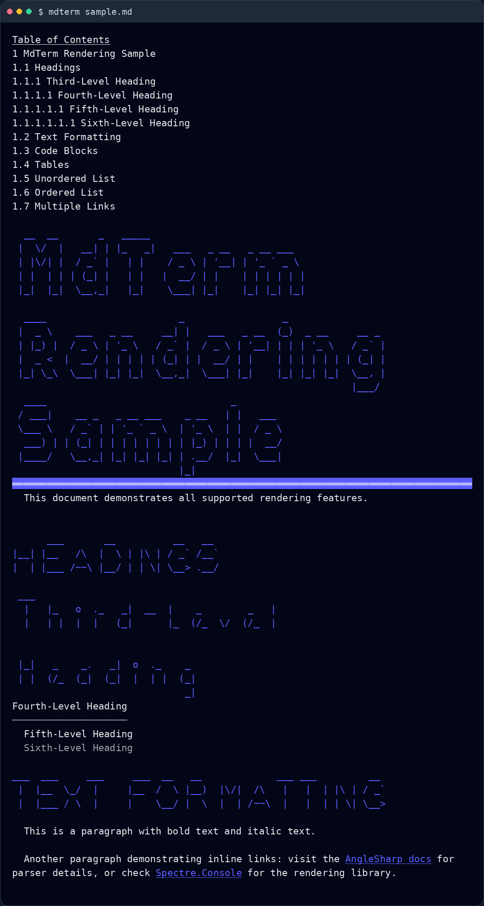
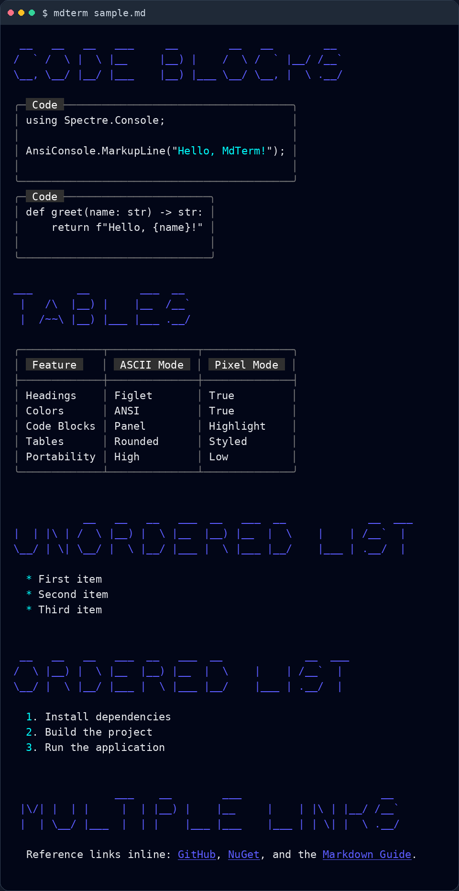
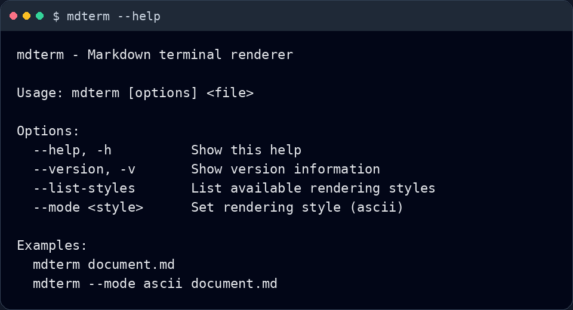

# mdterm

[](https://github.com/fasterinnerlooper/mdterm/actions/workflows/build.yml)
[](https://github.com/fasterinnerlooper/mdterm/actions/workflows/release.yml)
[](https://github.com/microsoft/winget-pkgs/tree/master/manifests/f/fasterinnerlooper/mdterm)
[](https://community.chocolatey.org/packages/mdterm)
[](https://github.com/fasterinnerlooper/scoop-bucket)
[](https://aur.archlinux.org/packages/mdterm)

Render Markdown files as styled terminal output.

## Highlights

- Parses Markdown with Markdig and AngleSharp.
- Renders headings, paragraphs, links, code blocks, tables, and lists.
- Generates a table of contents from document headings.
- Uses a pager when available so long output is easier to browse.
- Ships release artifacts for Windows, Linux, and macOS.

## Screenshots

### `mdterm sample.md`





### `mdterm --help`



## Installation

### Download a release

Download a prebuilt archive from the [latest release](https://github.com/fasterinnerlooper/mdterm/releases/latest).

### Package manager commands

These are the package manager targets reflected by the repository's release automation and latest successful release workflow:

```bash
winget install fasterinnerlooper.mdterm
choco install mdterm
scoop bucket add fasterinnerlooper https://github.com/fasterinnerlooper/scoop-bucket
scoop install mdterm
paru -S mdterm
# or
yay -S mdterm
```

## Usage

```bash
mdterm document.md
mdterm --mode ascii document.md
mdterm --list-styles
mdterm --help
```

Pass the path to a Markdown file and mdterm will render it directly in your terminal. Use `--help` to see the available CLI options in your installed build.

## Contributing

If you want to build, test, or contribute to mdterm, see [CONTRIBUTING.md](CONTRIBUTING.md).

## Privacy

mdterm is a local CLI tool. It reads a Markdown file from disk and renders it in your terminal. The application code in this repository does not include telemetry, analytics, or outbound network calls for document rendering.

## Security

If you discover a vulnerability, use the private reporting process described in [SECURITY.md](SECURITY.md).

## License

This project is licensed under the [MIT License](LICENSE).
