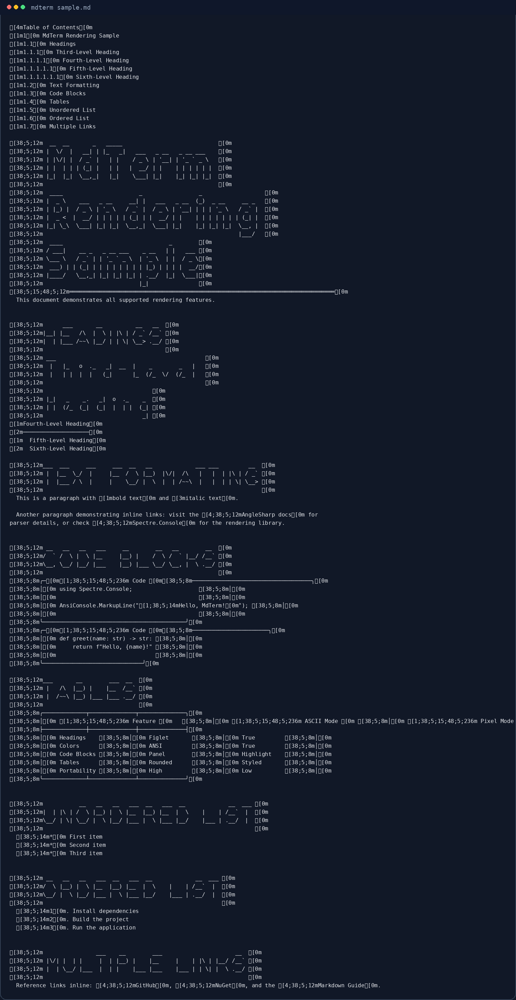
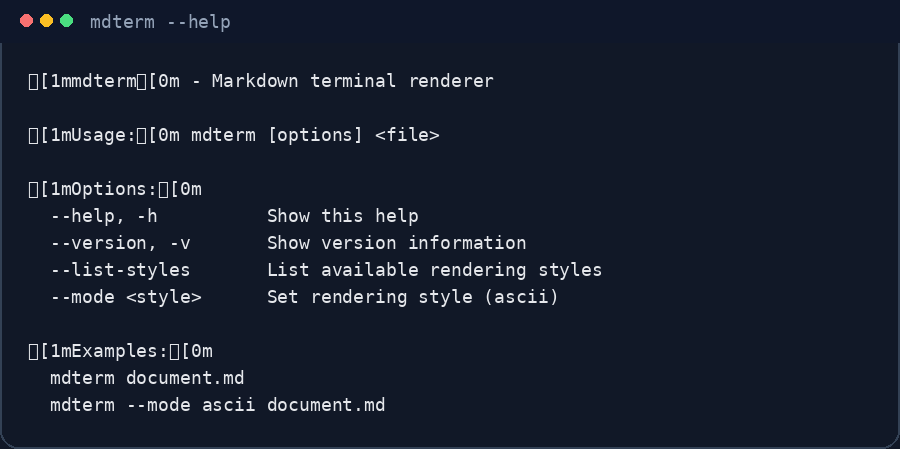

# mdterm

Render Markdown files directly in your terminal with styled headings, tables, code blocks, lists, and a generated table of contents.

## Screenshots

### `mdterm sample.md`



### `mdterm --help`



## Features

- Renders local Markdown files in the terminal
- Builds a table of contents from headings
- Formats code blocks, tables, lists, and inline emphasis
- Supports the built-in `ascii` rendering mode
- Uses a pager when available so longer output stays navigable

## Install

The release workflow publishes packages for these package managers:

- **Winget:** `winget install fasterinnerlooper.mdterm`
- **Scoop:** `scoop bucket add fasterinnerlooper https://github.com/fasterinnerlooper/scoop-bucket && scoop install mdterm`
- **Chocolatey:** `choco install mdterm`
- **Snap:** `snap install mdterm`
- **AUR:** `yay -S mdterm` or `paru -S mdterm`

You can also download prebuilt archives from the [GitHub Releases](https://github.com/fasterinnerlooper/mdterm/releases) page.

## Usage

```bash
mdterm document.md
mdterm --mode ascii document.md
mdterm --list-styles
mdterm --version
mdterm --help
```

## Build from source

CI uses .NET 9.0.x. For a local build on any platform:

```bash
dotnet restore
dotnet build MdTerm.csproj -c Release
dotnet test -c Release --no-build
```

For a self-contained publish like the release workflow, use a runtime-specific publish command:

```bash
dotnet publish MdTerm.csproj -c Release -r linux-x64 --self-contained -p:PublishSingleFile=true -o ./publish
```

To run locally from source:

```bash
dotnet run --project MdTerm.csproj -- sample.md
```

## Privacy

mdterm is a local CLI tool. It reads the Markdown file you point it at, converts it to formatted terminal output, and does not include telemetry, analytics, or any built-in network service.

## Security

Please report vulnerabilities privately through the repository's [Security tab](https://github.com/fasterinnerlooper/mdterm/security). See [SECURITY.md](SECURITY.md) for the full policy.

## License

mdterm is distributed under the **MIT** license.
